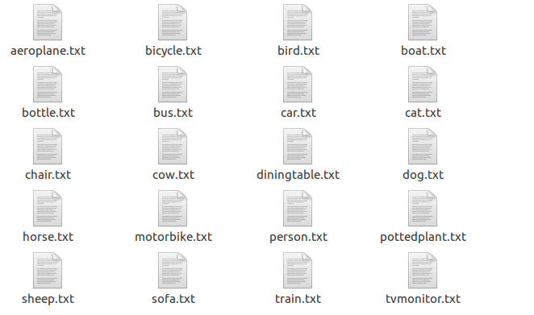
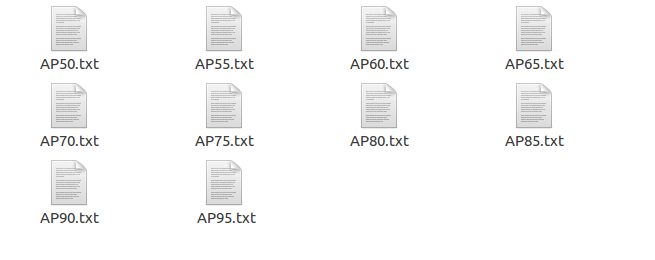

## Distance-IoU Loss into other SOTA detection methods can be found [here](https://github.com/Zzh-tju/DIoU). 

[[arxiv](https://arxiv.org/abs/1911.08287)] [[pdf](https://arxiv.org/pdf/1911.08287.pdf)]


## DIoU-Darknet

YOLOv3 with DIoU and CIoU losses implemented in Darknet

If you use this work, please consider citing:

```
@inproceedings{zheng2020distance,
  author    = {Zhaohui Zheng, Ping Wang, Wei Liu, Jinze Li, Rongguang Ye, Dongwei Ren},
  title     = {Distance-IoU Loss: Faster and Better Learning for Bounding Box Regression},
  booktitle = {The AAAI Conference on Artificial Intelligence (AAAI)},
   year      = {2020},
}
```

## Modifications in this repository

This repository contains a YoloV3 implementation of the IoU, GIoU, DIoU and CIoU losses while keeping the code as close to the GDarknet as possible. It is also possible to train with MSE loss as well, see the options below. 

### Losses

The loss can be chosen with the `iou_loss` option in the `.cfg` file and must be specified on each `[yolo]` layer. The valid options are currently: `[iou|giou|diou|ciou|mse]`

```
iou_loss=mse
```

### Normalizers

We also implement a normalizer between the localization and classification loss. These can be specified with the `cls_normalizer` and `iou_normalizer` parameters on the `[yolo]` layers. The default values are `1.0` for both. In our constrained search, the following values appear to work well for the loss.

```
iou_loss=diou
cls_normalizer=1
iou_normalizer=1.0
```
```
iou_loss=ciou
cls_normalizer=1
iou_normalizer=0.5
```
### DIoU-NMS

NMS can be chosen with the `nms_kind` option in the `.cfg` file and must be specified on each `[yolo]` layer. The valid options are currently: `[greedynms|diounms]`

```
nms_kind=greedynms
```
```
nms_kind=diounms
```
Besides that, we also found that for YOLOv3, we introduce beta1 for DIoU-NMS, that is DIoU = IoU - R_DIoU ^ {beta1}. With this operation, DIoU-NMS can perform better than default beta1=1.0.

In our constrained search, the following values appear to work well for the DIoU-NMS.
```
beta1=0.6
```

While for SSD and Faster R-CNN， beta1 can be 1.0 which is good enough. Of course, beta1=1.0 for YOLOv3 is still better than greedy-NMS.
### Data

#### Augmentation

It has been reported that the custom data augmentation code in the original [Darknet repository](https://github.com/pjreddie/darknet) is a significant bottleneck during training. To this end, we have replaced the data loading and augmentation with the OpenCV implementation in [AlexeyAB's fork](https://github.com/AlexeyAB/darknet).

#### Output Prefix

To enable multiple simultaneous runs of the network, we have added a parameter named `prefix` to the `.data` config file.

This parameter should be set to your run name and will be used in the appropriate places to separate output by prefix per running instance.

## Scripts

A description of the scripts contained in this repository follows.

### Data pre-processing

see: `scripts/get_2017_coco_dataset.sh`

### Evaluation

See `scripts/voc_all_map.py` for VOC evaluation and  `scripts/coco_all_map.py` for COCO evaluation and `scripts/crontab.tmpl` for usage

## Pre-trained Models

See the [Workflow](#workflow) and [Evaluation](#evaluation) sections below for details on how to use these files

|Link|loss|AP|
|--|--|--|
|https://pan.baidu.com/s/1OmQyEvE8E_tR0Z9FTVvPRg|iou loss|46.57|
|https://pan.baidu.com/s/1Hr6VgCItMLCqEIT07hh-EQ|giou loss|47.73|
|https://pan.baidu.com/s/1QVTXmdRpAnMr4kM5Zvl_3A|diou loss|48.10|
|https://pan.baidu.com/s/158WSZy8QY_SSoF4FBTF26Q|ciou loss|49.21|
## Workflow

When training the network I used 2 GPUs on one Ubuntu machine. Note that the `cfg/[run name].cfg` file contains parameters that must be changed when changing the number of GPUs used for training.

```
./darknet detector train cfg/voc-diou.data cfg/voc-diou.cfg darknet53.conv.74 -gpus 0,1
```

I change `cfg/[run name].cfg`, decreasing the `learning_rate` by setting `NEW_RATE = ORIGINAL_RATE * 1/NUMBER_OF_GPUS` and increasing the `burn_in` setting it to `NEW_BURN_IN = ORIGINAL_BURN_IN * NUMBER_OF_GPUS`

So for one GPU, the relevant portion of the `.cfg` file would be:

    learning_rate=0.001
    burn_in=1000

And for two GPUs, the relevant portion of the `.cfg` file would be:

    learning_rate=0.0005
    burn_in=2000

And for four GPUs, the relevant portion of the `.cfg` file would be:

    learning_rate=0.00025
    burn_in=4000

If you want to resume the run from a specific iteration's weight file or in the case below, the backup, passing in the GPUs to run with using:

```
./darknet detector train cfg/voc-diou.data cfg/voc-diou.cfg backup/yourpath/voc-diou_30000.weights -gpus 0,1
```
Note that the burn_in must be 0 when you resume training.

## Training YOLO on VOC

Get The Pascal VOC Data:

```
wget https://pjreddie.com/media/files/VOCtrainval_11-May-2012.tar
wget https://pjreddie.com/media/files/VOCtrainval_06-Nov-2007.tar
wget https://pjreddie.com/media/files/VOCtest_06-Nov-2007.tar
tar xf VOCtrainval_11-May-2012.tar
tar xf VOCtrainval_06-Nov-2007.tar
tar xf VOCtest_06-Nov-2007.tar
```
Then
``` 
python scripts/voc_label.py
```

Put them in the following dir
```
VOCdevkit
├── VOC2007
    ├──Annotations
    ├──ImageSets
    ├──JPEGImages
    ├──labels
    ├──SegmentationClass
    ├──SegmentationObject
├── VOC2012
    ├──Annotations
    ├──ImageSets
    ├──JPEGImages
    ├──labels
    ├──SegmentationClass
    ├──SegmentationObject
```

Now, yourpath/DIoU-darknet/ will have several txt file like this:
2007_test.txt, train.txt

Training set contains 16551 images, and validation set contains 4952 images.

## Evaluation

### VOC

Evaluate all weights files in the given `weights_folder` with both the IoU and GIoU metrics using the following script:

    python scripts/voc_all_map.py --data_file cfg/yolov3-voc-lin-1.data --cfg_file cfg/yolov3-voc-lin-1.cfg --weights_folder backup/yolov3-voc-lin-1/

When you finish the training, you can validate it:

```
./darknet detector valid voc-diou.data voc-diou.cfg backup/your_weight_path/your_weight.weights
```
There will be 20 txt files generated in /yourpath/DIoU-Darknet/results/.


Then for validation, I mainly use three files: compute_mAP.py, voc_eval.py, map.py

You can put the three in the same directory.

Firstly,
```
python eval/compute_mAP.py
```
This will create 10 txt files, each of them contains mAP for 20 classes. 


You can open eval/voc_eval.py to modify the path at the end of the file. (See ☆☆☆☆☆ )

Secondly, open `eval/map.py` to modify to your path.
```
python eval/map.py
```
This will print the AP in the terminal and calculate the mAP for different threshhold, e.g, AP50, AP75.
AP50, AP55, ..., AP95 will appear at the last line of 10 txt files generated above.
```
aeroplane 	0.859953927601302
bicycle 	0.8570948725214653
bird 		0.7815241730933422
boat 		0.6885571683084716
bottle 		0.6878002434239279
bus 		0.8774114526435925
car 		0.9124346504544593
cat 		0.8962038854301146
chair 		0.6142762879219088
cow 		0.8346408862658632
diningtable 	0.7162604144581127
dog 		0.8688758188651542
horse 		0.8948186206841635
motorbike 	0.8704952288269674
person 		0.8628876984931069
pottedplant 	0.500699583013652
sheep 		0.8041337922413851
sofa 		0.7793190004011306
train 		0.8627512497332716
tvmonitor 	0.7799964431935789

0.797507
```

### COCO

Evaluate all weights files in the given `weights_folder` with both the IoU and GIoU metrics using the following script:

    python scripts/coco_all_map.py --data_file cfg/coco-giou-12.data --cfg_file cfg/yolov3.coco-giou-12.cfg --weights_folder backup/coco-giou-12 --lib_folder lib --gpu_id 0 --min_weight_id 20000

See the [scripts/crontab.tmpl]() file for details

Evaluate a specific weights file:

    mkdir -p results/coco-giou-12 && ./darknet detector valid cfg/runs/coco-giou-12/coco-giou-12.data cfg/runs/coco-giou-12/yolov3.coco-giou-12.cfg backup/coco-giou-12/yolov3_final.weights -i 0 -prefix results/coco-giou-12

The detector results are written to `coco_results.json` in the prefix specified above

Now edit `scripts/coco_eval.py` to load the this resulting json file and run the evaluation script:


## TODOs

The described setup requires a shared file system when training and testing across multiple machines. In the absence of this, it would be useful to have some logging service to aggregate logs over a network protocol vs requiring a write to shared disk.

## Acknowledgments

Thank you to the Darknet community for help getting started on this code. Specifically, thanks to [AlexeyAB](https://github.com/AlexeyAB/) for his fork of [Darknet](https://github.com/AlexeyAB/darknet), which has been useful as a reference for understanding the code.

And thank you to the GDarknet for their excellent work. (https://github.com/generalized-iou/g-darknet)


## Original Readme


# Darknet #
Darknet is an open source neural network framework written in C and CUDA. It is fast, easy to install, and supports CPU and GPU computation.

For more information see the [Darknet project website](http://pjreddie.com/darknet).

For questions or issues please use the [Google Group](https://groups.google.com/forum/#!forum/darknet).
